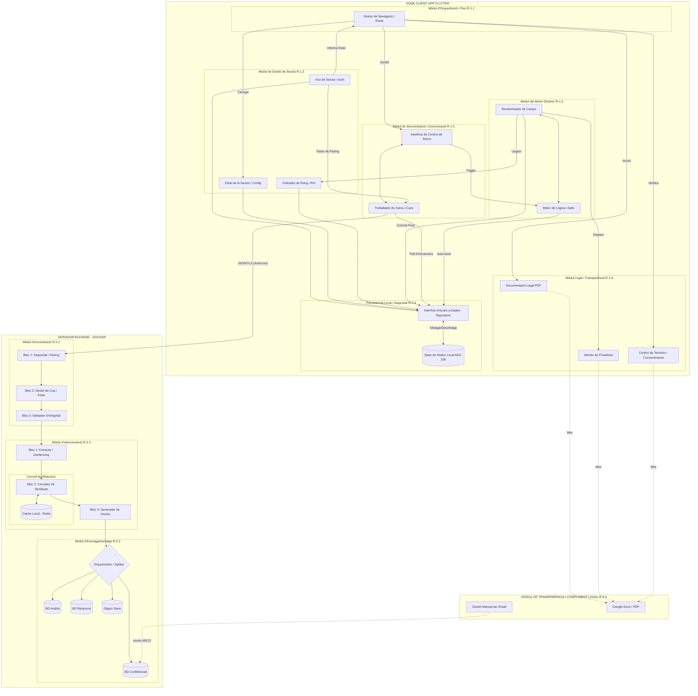

[https://mermaid.live/edit#pako:eNqNWFtv2zgW_iuEgEESIE5iJ04TY1FAltRAu75kJCVbVB4ErMQonOrioaQibd1iHud55g_s4-7DvMy-7pv_2B6SskTLl9RFEUr8DnnOx3OjvmhBFhJtoM3SiOH50yxF8PvhBzQcTQ3UHSBjZFsTDx16-nBkeUdyPi_fCzQaxlnwoM_nyJ9MTasCD5B-e4vejO48z3J-khL814xg_e7JJRpZN_oIwUb6qJmr1x5nYRk_jEiEY-SPl3_BE5JPFHkMp_kcs-W_04Bi5HRgOWUn_ntDUzMLfPhfJiQtcECX_63kb803m2ArISwiqZ0-ZszXY8IKkqOQoFtGP-KQ5HhTBKz_4BtZWrAs5lCPsISmNAcF4W0Ou1K-da5IkjScpS0iumjq_HhnuZ6jG_byj51UTNkvJckLBqZkNSPhgfIaLKToTVw-C0a6LY3HmKaVtv4NSGSMKz3BH4GUStYpweoX1O0h13LdfYq6JM9VFQni2_EdYCgmYcg17LU01MviaRwx305pQFXwqZhqoeU26T0u48K38gIXXCTGihSY-0ijlpydhjRwcBr5YoRDSQR_AyJOFr9AwDkaT72pg0x7svx1bBs7eRhnnOOGhhjJNyZNl_9KaCA4OG_7VcYSB7YljDBfDmjxeaWkgZN53pIYZRENrDSiKfHlBgAcLf-CtxjO1MVx0Rb5kXsMcIcZNYf-oUHzgsTAXHhgQ0CF3GnBm5N5xnB89AIdF-jWclzb9Za_TQxb38nGLWE530dErF89VQE8ygIR1y6JSkb4SXJqLlpam0M7LQh7xAHx5Wj5Z0AJaK0HwfI_OcLI5KGKOsgh8yynwMWn1hpWGrBP84KE3O4hzgknS0pJJXTL7fT6l0e790Z_63ReL97SR4aLiJyaJH-uxgt1-f2s9ZExHd9NbGN_zBtZkuRqJLkUdshS7hJVzAKkhHiRj5y2fjtOPqXBnb3OGEFK3pJrtqQmpPhnxj6AE3qMvMfgHZULvsXsmfuVUW5LFfJfnXLUfPDt27ctmWwTvpbnGiG5yneCBW_fiRVF4Tu0FrG1iZMh18BUP29jZf3ZhX157a1mSR9p2YPWlwOf63Q6yJ5ASTamk4n11p5OXCSKDgTujc0LEIfsKNeiqIQHmDHQFYf8_D_imIbC6xpklcD5Qp3XaCGKaYKRSM4LtQApNjQvV2IG3ybCi7UMv1fiHpLkI8TAYlWW95pBUCFdmg9DEfuHXgYpb45zqNpoThiKD2gTL0e7LFSyQgNRtd6Hq-vQPpBaDmp-4MBpwU3F8WK7WB29PFkJoduS29vk95bgGk3iPQ5ERsHJeyCjzEuoFXDqsawre09DZuNF1YLthVaNwaJKUgqJ4nmlfW3OBqBax2M0ighbqMVwmw-s0VktvlVEeVmbVRZZJ4d2abFeP3f4GliakmcAiTYyALvJc8EZ5OFJeY0DV4Oe4Jfl_-rF9p_7CEQJfV40nrMfb1LeI8ugUNvbHQo3xRf0feZZfmdge9kHUJ53x5gymkaL9gnV1UC9TvQG0Do697YJzdOhOTX-YTlbLxQuYR8przZ-DR_qgJ6YUNml3K5rxXj5u3k3QnAXce2J4Uwntvduf4XlflQX2HZ1dTq9jTZ62PW5lvxy1DBGV0y0wT0JBtOVHtgoeQIVWbGNP5f48wG6F_lVFN0DHpARo1vwXcQPZNiTf873NR0rbg7UKrCHGZEFlIuGeA6kV1fctBv4lnIPDokfGrqsZ157eUWjwEb2yMveBmPrT7VKtywLSP5ggGtAp4r81YA37iTmFT1tN7mNCs0hgFjd8Ls0oRCIZbhN0MDBExEdIbTHfFy1h7y1DGl-tHsv0R4q8utAcSwvUdY4wQ1JIRNXCt-Dd8akrW3FsnSASoVm_H0eYY3H-o3uvbPGundj7Y4VODscEcUnrCTBES4-k4T3v8In2hcaaMUxK3g8f6kbMG7QKXLnQD_41NeWQaYBrbkpL2-h6I3iNt9DUxcYHW5SMc3p5rwj5mvf2ARM_cPp-59JUCBuFjna64eNEZJb03hhXn9h3nlhfrrv3JTSAqWcEZSI81A6w-G54gNd5b10CjHZ7KnkbGl6K2-fXA4QNIoT91Z31FveetpefZSpbnhNKl4XhRCy3kICmiiEWwmm8qMEzyxjnJYQarwNExMKEPqJ3L_JsigmYgxe1HzNUYiqP0zxtnhTOwVUF5tdyJqLzQtb02V1xO_1Yqb93Z1OTr2Riw71fPmnKCdHM20BmbpeyLFGsAjvv_k3s-nEc6ajU_3OtL2ps6JW9k6ocwI_WHdMeMMGBtezakHfA-PN8K5pQW49Wd2hdagMC-ngEqUda1B6Qm1QsJIca7AtiMGj9oXPz7TiiSRkpg1gGGL2YabN0q8gM8fpuyxLVmIsK6MnbfCI4xyeynmIC2JSDO7TQET7YmRlWmiD7tX15ZVYRRt80Z61Qeeid3bS7169urw67571Ly6vj7VPgIMCfX3V7fcvzs675696Z6--Hmufxca9k4uLs4vr626_e3bZPzvrH2uQuiHWx_KTp_jy-fX_e81hvA](https://mermaid.live/edit#pako:eNqdWFtv47gV_iuEgEUSIE7WdpxNjGIBWdIEan2rpKSDkYuAIzEKO7p4KWngmfEM-tjn9g_0sX3Yl-1r3_zHekjKEi3HzqAeDEKJ55DnfDyXj_qiBVlItKG2SCOGl8-LFMHvhx_QaDwzUHeIjLFtTT106umjseWdyfm8fC-k0SjOgkd9uUT-dGZalfAQ6fM5ejO-9zzL-bPU4L9mBOt3L67R2LrTxwg20sfNXL32JAvL-HFMIhwjf7L5DZ6QfKLIYzjNl5ht_pUGFCOnA8spO_HfG5qaWeDD_zIhaYEDuvlPpT833-wLWwlhEUnt9Cljvh4TVpAchQTNGf2IQ5LjfRXw_oNvZGnBspiLeoQlNKU5GAhvc9iV8q1zRZOk4SJtAdFFM-eP95brObphb_5xEIoZ-6UkecHAlaxGJDxRXoOHFL2Jy5VApNuyeIJpWlnr34FGxrjRU_wRQKl0nRK8fsXcHnIt1z1mqEvyXDWRIL4d3wGGYhKG3MJey0K9LJ4nEfPtlAZUFb4UUy1puU36gMu48K28wAVXibGiBe4-0ailZ6chDRycRr4Y4VACwd-AipPFrwDQR5OZN3OQaU83f53YxkEcJhnHuIEhRvKNSdPNPxMaCAz67bjKWOLAtoQR5ssBLT5vjTRwssxbGuMsooGVRjQlvtwABMeb3-AthjN1cfxqCF6hueW4tutt_jY1bP2gR3PCcpoXRGSdXz1VSTjOApGbLolKRvhpcPeuWsaaIzstCHvCAfHlaPNrQAnEsR4Em3_nCCOTpxvqIIcss5yCP59aa1hpwD4tCxKaI_90hHPCHZZa0gjdcju9wfXZ4b3R7zqdn9dv6RPDRUQuTZKvqvFaXf44agNkzCb3U9s4nrdGliS5mg0uhR2ylB9rlXcgUkLMy0cO26Ad65_S4N7eRYwgpfbINVtaU1L8KWMfIJA8Rt7jON6G0VvMVjw2jPKldJf_6rKh5vS3b99eqEb74ju1qlGSq3ynsMDtO2VFYf8Oq0V-7MvJtGnE1Dhvy8oeckj29bVfdEvGSMsftLscxFyn00H2FNqqMZtOrbf2bOoi0Tggce9s3kS4yIGWKxpDeIIZA1txyM__I45pKKKukayKMF-o8zNai4aYYCQK7FptIooPzcutmsG3ifB6p0of1XiAQvcEObDettajbhBUyJDmw1Dk_qmXFTla4hw6L1oShuIT2uTL2SEPlarQiKhWH5Ore8kxIbWk1_jAgdOCu4rj9ctqdfZudeYld_fEhkgLOa9o6e2gJN7jQBQUnLwHLMq8xIzCoceyNRw9DFmM1xWLOipa9fZ1VaMUDMUzr7RcrvZmT6Bax2M0ighbq_3spRDYQbNa_EUV5WXtVllknRwYzwHIdyAEP1OygigQPDAAr8mq4Pjx3KS8wUGcQVP_ZfNfDkGWArzHD30MqoSu1k3YHJH_v3-wkUk5O5appBLbA542LRscXfHecLAceNkH8JrzYkwZTaN1-2DrHqJeJHpDII3Og20CbTo1Z8YfLOfFq4RL2EfKe5Rfi490kJ6awAek3qELxWTzd_N-jOAW4tpTw5lNbe_d8b7Mw69uy-2e7HR6ewR61PW5lfxa1CBGt0i0hXtSGFxX2K9R8rIramlbvi_l-0P0IKqyaNUnPEgjRl-Q7yJ-IKOe_NM_RlW22JyoveMIMiIzlCuGeA5kOlTYtKl7y7hHh8SPDVzWinds3gcpoJE98Wa5h9juU23SnGUByR8NCA0C9c_fDjhlJzHnAWmbETcmNIcAajXVd2lCIYPL8CVFAwfPRPBI_1SMK1LJCWlI87PDewlSqejvCopjeQ2yJgjuSAoFvDL4AaIzJm1rK5RlAFQmNOPviwhrMtHvdO-dNdG9O-twrsDZ4YgoMWElCY5w8ZkknDWLmGhfZYDAY1bwfP5S0zbu0CVylwA_xNTXlkOmAYTelNe2UDCquI33yNSFjA53qJjmdH_eEfN1bOwLzPzT2fu_kKBA3C1ydjQOGycktqbxyrz-yrzzyvzs2LkpPQkYACMoEeeh8MlRX4mBrvJeBoWYbPZUarZ0vVW3L66HCOjl1J3rjno33C3b288x1b2wKcW7qpBC1lsoQFMFcCvBVH6O4JVlgtMSUo2TNzGhCAINyf27LItiIsYQRc13HAWo-pMUJ9P71h0S2nYeZb5uRodWqrHavwbucjfeOtcL7ffubHrpjV10quebX0W_OVtoayjl9UqONYZVOK3nn9NmU8-ZjS_1e9P2Zs4We8nJUOcCfrDuhHAiCIjUs2rHPyLGOfahaYF-PVldzXVoHWuZAVJKO9egN4XasGAlOddgW1CDR-0Ln19oxTNJyEIbwjDE7MNCW6RfQWeJ03dZlmzVWFZGz9rwCcc5PJXLEBfEpBjiqxERxMjIyrTQhr3bm55YRBt-0VbasHP14-3FzWBwdX3z0-Bc-wRvbrsX3eub3s1t9-Zq8NOP_e7Xc-2z2LJ7cdO7vh10r2_7_Zur20H_6lyDsg51YCI_hIrvoV__B3iSYbk)

