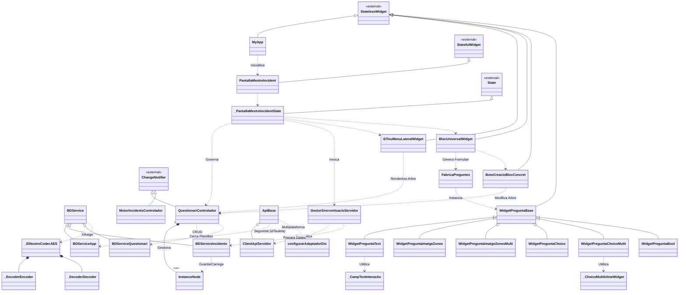
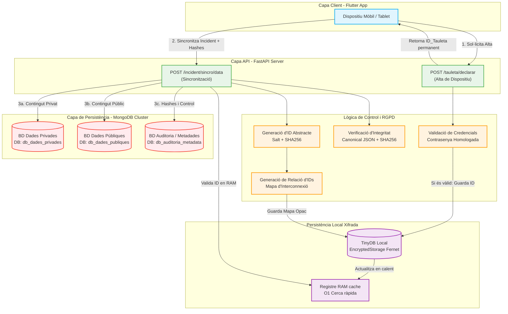

Complet:

```mermaid
classDiagram

    %% ==========================================
    %% RELACIONS DEL Punt d'Arrencada de l'Aplicació (Bootstrap)
    %% ==========================================
    StatelessWidget <|-- MyApp
    MyApp ..> PantallaMestreIncident : enlaire com a vista inicial

    %% ==========================================
    %% RELACIONS DEL MÒDUL D'EMMAGATZEMATGE & CONTROL
    %% ==========================================
    BDService <|-- BDServiceApp
    BDService <|-- BDServiceIncidents
    BDService <|-- BDServiceQuestionari

    BDService ..> _ElNostreCodecAES : utilitza
    _ElNostreCodecAES *-- _EncoderEncoder : conté
    _ElNostreCodecAES *-- _DecoderDecoder : conté

    %% El servei d'incidents utilitza i gestiona estructures de nodes
    BDServiceIncidents ..> InstanceNode : manipula / reconstrueix

    %% Lògica de control i gestió d'estat (ChangeNotifier)
    ChangeNotifier <|-- QuestionariControlador
    ChangeNotifier <|-- MotorIncidentsControlador
    QuestionariControlador "1" *-- "many" InstanceNode : gestiona llista plana
    QuestionariControlador ..> BDServiceIncidents : llegeix/escriu dades d'incident
    QuestionariControlador ..> BDServiceQuestionari : llegeix estructures de plantilla

    %% ==========================================
    %% RELACIONS DEL MÒDUL DE COMPONENTS GRÀFICS (UI)
    %% ==========================================
    StatelessWidget <|-- WidgetPreguntaBase
    
    %% Connectar els nous ginys a la classe mare abstracta
    WidgetPreguntaBase <|-- WidgetPreguntaText
    WidgetPreguntaBase <|-- WidgetPreguntaImatgeZones
    WidgetPreguntaBase <|-- WidgetPreguntaImatgeZonesMulti
    WidgetPreguntaBase <|-- WidgetPreguntaChoice
    WidgetPreguntaBase <|-- WidgetPreguntaChoiceMulti
    WidgetPreguntaBase <|-- WidgetPreguntaBool

    StatefulWidget <|-- _CampTextInteractiu
    State <|-- _CampTextInteractiuState
    
    %% Relacions de dependència interna de la UI
    WidgetPreguntaText ..> _CampTextInteractiu : renderitza
    _CampTextInteractiu ..> _CampTextInteractiuState : crea estat
    
    %% Relacions del giny d'estat privat per a la selecció múltiple inline
    StatefulWidget <|-- _ChoiceMultiInlineWidget
    State <|-- __ChoiceMultiInlineWidgetState
    WidgetPreguntaChoiceMulti ..> _ChoiceMultiInlineWidget : renderitza
    _ChoiceMultiInlineWidget ..> __ChoiceMultiInlineWidgetState : crea estat
    
    %% Relacions del Motor Gràfic Dinàmic (Fabrica i Llenç)
    StatelessWidget <|-- BlocUniversalWidget
    StatelessWidget <|-- BotoCreacioBlocConcret
    
    BlocUniversalWidget ..> FabricaPreguntes : delega construcció
    BlocUniversalWidget ..> BotoCreacioBlocConcret : llista botons de fills
    FabricaPreguntes ..> WidgetPreguntaBase : instanciació dinàmica
    FabricaPreguntes ..> QuestionariControlador : llegeix/escriu estat RAM
    BotoCreacioBlocConcret ..> QuestionariControlador : invoca mutacions de l'arbre

    %% Infraestructura estructural del Frame Principal (Master-Detail)
    StatefulWidget <|-- PantallaMestreIncident
    State <|-- _PantallaMestreIncidentState
    PantallaMestreIncident ..> _PantallaMestreIncidentState : crea estat

    %% Connexions d'orquestració de la Interfície d'Usuari
    StatelessWidget <|-- ElTeuMenuLateralWidget
    ElTeuMenuLateralWidget ..> QuestionariControlador : llegeix llista per reflectir arbre
    
    _PantallaMestreIncidentState ..> QuestionariControlador : inicialitza i governa cicle de vida
    _PantallaMestreIncidentState ..> GestorSincronitzacioServidor : llança fluxos de xarxa xifrats
    _PantallaMestreIncidentState ..> ElTeuMenuLateralWidget : conté com a índex
    _PantallaMestreIncidentState ..> BlocUniversalWidget : conté com a visor detallat
    
    %% ==========================================
    %% RELACIONS DEL MÒDUL DE COMUNICACIÓ (XARXA)
    %% ==========================================
    ApiBase <|-- ClientApiServidor
    ApiBase ..> BDServiceApp : llegeix/escriu 'id_tauleta' per assegurar identitat
    ApiBase ..> configurarAdaptadorDio : delega injecció de l'HttpClient segons plataforma
    
    GestorSincronitzacioServidor ..> ClientApiServidor : invoca endpoint de sincronització
    GestorSincronitzacioServidor ..> BDServiceIncidents : extreu mapes d'incidents (públic/privat)
    

    %% ==========================================
    %% DEFINICIÓ DEL PUNT D'ARRENCADA (BOOTSTRAP)
    %% ==========================================
    class MyApp {
        +build(BuildContext context) Widget
    }
    
    %% ========================================== 
    %% CLASSES EXTERNES DEL FRAMEWORK FLUTTER 
    %% ========================================== 
    class StatelessWidget { <<external>> } 
    class StatefulWidget { <<external>> } 
    class State { <<external>> } 
    class ChangeNotifier { <<external>> }
    
    %% ==========================================
    %% DEFINICIÓ DE CLASSES: PERSISTÈNCIA & MODEL
    %% ==========================================
    class BDService {
        <<abstract>>
        -bool _estaConnectat
        -Database? _base_de_dades
        #List~StoreRef~ coleccions
        +bool estaLlest
        -_Database? _db
        #SembastCodec _crearCodecAES256(String contrasenyaUsu)
        #Future~bool~ obrirBaseDeDades(String contrasenyaUsu, String idBD)
        #Future~void~ tancarBaseDeDades()
        #void initColeccions(String nomColeccio)
        #Future~int~ guardar(int idColeccio, Map dades)
        #Future~List~ llegirTot(int idColeccio)
        #Future~List~ buscar(int idColeccio, Finder filtre)
        #Future~Map?~ actualitzar(int idColeccio, int idIncident, Map actualitzacio)
        #Future~dynamic~ esborrar(int idColeccio, int idRegistre)
        #Future~int~ comptar(int idColeccio, Filter? filtre)
        #Future~int~ esborrarColleccioSencera(int idColeccio)
        #Future~void~ guardarPerId(int idColeccio, int idRegistre, Map dades)
        #Future~Map?~ llegirPerId(int idColeccio, int idRegistre)
    }

    class BDServiceApp {
        -$BDServiceApp? _instance
        -BDServiceApp._internal()
        +$init(String contrasenya) Future~bool~
        +$close() Future~void~
        +llegirDada(String clau) Future~dynamic~
        +escriureDada(String clau, dynamic valor) Future~void~
        -_obtenirMapaUnificat() Future~Map~
    }

    class BDServiceIncidents {
        -$BDServiceIncidents? _instance
        -BDServiceIncidents._internal()
        +$init(String contrasenya) Future~bool~
        +$close() Future~void~
        +guardarBlocsIncident(int idIncident, List llistaCompletaJson, Map definicioPreguntes) Future~void~
        +carregarBlocsIncident(int idIncident) Future~List?~
        +getPublicIncident(int idIncident) Future~Map?~
        +getPrivatIncident(int idIncident) Future~Map?~
    }

    class BDServiceQuestionari {
        -$BDServiceQuestionari? _instance
        -BDServiceQuestionari._internal()
        +$init(String contrasenya) Future~bool~
        +$close() Future~void~
        +guardarArbreBlocs(int idQuestionari, Map mapaConfiguracioGlobal) Future~void~
        +carregarArbreBlocs(int idQuestionari) Future~Map?~
    }

    class _ElNostreCodecAES {
        +EncoderEncoder encoder
        +DecoderDecoder decoder
    }

    class _EncoderEncoder {
        +Encrypter encrypter
        +convert(Map input) String
    }

    class _DecoderDecoder {
        +Encrypter encrypter
        +convert(String input) Map
    }

    class InstanceNode {
        +String id
        +String? idPare
        +String titol
        +String tipusPlantilla
        +int profunditat
        +Map respostes
        +copyWith() InstanceNode
        +toJson() Map
        +$fromJson(Map json) InstanceNode
    }

    %% ==========================================
    %% DEFINICIÓ DE CLASSES: INTERFÍCIE GRÀFICA (UI)
    %% ==========================================
    class WidgetPreguntaBase {
        <<abstract>>
        +int numero
        +String text
        +String valorActual
        +ValueChanged~String~ onCanvi
        +String posicioResposta
        +Map? metadadesExtra
        +buildLeftInput(BuildContext context) Widget?
        +buildExtraInfo(BuildContext context) Widget?
        +buildBottomInput(BuildContext context) Widget?
        +build(BuildContext context) Widget
    }

    class WidgetPreguntaText {
        +buildBottomInput(BuildContext context) Widget?
    }

    class _CampTextInteractiu {
        +String valorInicial
        +ValueChanged~String~ onCanvi
        +createState() _CampTextInteractiuState
    }

    class _CampTextInteractiuState {
        -TextEditingController _textController
        -FocusNode _focusNode
        +initState() void
        +didUpdateWidget(oldWidget) void
        +dispose() void
        +build(BuildContext context) Widget
    }

    class WidgetPreguntaImatgeZones {
        +buildBottomInput(BuildContext context) Widget?
    }

    class WidgetPreguntaImatgeZonesMulti {
        +buildBottomInput(BuildContext context) Widget?
    }
    
    class WidgetPreguntaChoice {
        +buildBottomInput(BuildContext context) Widget?
    }

    class WidgetPreguntaChoiceMulti {
        +buildBottomInput(BuildContext context) Widget?
    }

    class _ChoiceMultiInlineWidget {
        +List~String~ opcions
        +String valorActual
        +ValueChanged~String~ onCanvi
        +createState() __ChoiceMultiInlineWidgetState
    }

    class __ChoiceMultiInlineWidgetState {
        -bool _esObert
        -String _filtre
        +build(BuildContext context) Widget
    }

    class WidgetPreguntaBool {
        +Widget? ginyExtraInformatiu
        +Widget? ginyInferiorOpcional
        +buildLeftInput(BuildContext context) Widget?
        +buildExtraInfo(BuildContext context) Widget?
        +buildBottomInput(BuildContext context) Widget?
    }
    
    class QuestionariControlador {
        +List~InstanceNode~ llistaPlanaBlocs
        -int _incidentActualId
        +String idBlocSeleccionat
        +Map plantillesPreguntes
        +Map metadadesCreacio
        +bool enCarrega
        -_obtenirUltimIndexDescendent(String idNode) int
        +afegirSubBloc(String idPare, String tipus, String titolBase) void
        +esborrarBloc(String idBlocAEliminar) void
        +redefinirPareDeBloc(String idBlocAMoure, String idNouPare) void
        -_recollirDescendentsRecursius(String idPare, List~InstanceNode~ resultat) void
        +inicialitzarNouIncident(int idIncident) void
        +inicialitzarFluxIncident(int idIncident) Future~void~
        -_guardarA_Sembast() void
        +obtenirValorCamp(String idBloc, String clauCamp) String
        +guardarValorCamp(String idBloc, String clauCamp, String valor) void
    }

    class FabricaPreguntes {
        <<utility>>
        +$construir(Map jsonPregunta, String idBlocActiu, QuestionariControlador controlador) WidgetPreguntaBase
    }

    class BlocUniversalWidget {
        +InstanceNode nodeBloc
        +QuestionariControlador controlador
        +List plantillesPreguntes
        +Map? metadadesCreacio
        +build(BuildContext context) Widget
    }

    class BotoCreacioBlocConcret {
        +String idPare
        +String tipusBlocAcrear
        +String titolBase
        +QuestionariControlador controlador
        +build(BuildContext context) Widget
    }
    
    class MotorIncidentsControlador {
        -int? _idIncidentActiu
        -bool _estaSincronitzantAmbServidor
        +int? idIncidentActiu
        +bool estaSincronitzant
        +seleccionarIncident(int id) void
        +canviarEstatSincronitzacio(bool estat) void
    }

    class ElTeuMenuLateralWidget {
        +QuestionariControlador controlador
        +build(BuildContext context) Widget
        -_construirBotoCanviPare(BuildContext context, InstanceNode node) Widget
        -_mostrarConfirmacioEsborrat(BuildContext context, InstanceNode node) void
    }

    class PantallaMestreIncident {
        +createState() _PantallaMestreIncidentState
    }

    class _PantallaMestreIncidentState {
        -QuestionariControlador _questionariControlador
        -GestorSincronitzacioServidor _gestorSincronitzacio
        -bool _menuObert
        -int _idIncidentActiu
        +initState() void
        -_processarSincronitzacioInterficie(BuildContext context) Future~void~
        +build(BuildContext context) Widget
    }

    class GestorSincronitzacioServidor {
        +executarFluxSincronitzacio(int idIncident) Future~bool~
        -_generarHashCompatiblePython(Map dades) String
    }

    %% ==========================================
    %% DEFINICIÓ DE CLASSES: GESTIÓ DE XARXA & API
    %% ==========================================
    class ApiBase {
        <<abstract>>
        -Dio _dio
        -String _baseUrl
        -String? _idTauleta
        -bool _isidTauleta
        -String _contrasenyaSeguretat
        -String _modelDispositiu
        +bool isidTauleta
        #postProcess(String path, dynamic data) Future~Response~
        #getProcess(String path, Map? queryParams) Future~Response~
        #_gestionarErrorXarxa(DioException e) void
        #getIdTauleta() String?
        #initContrasenya(String contrasenya, String model) void
        #declararTauleta(String model, String contrasenya) Future~String?~
        #assegurarIdentitat() Future~void~
    }

    class ClientApiServidor {
        -$ClientApiServidor? _instance
        -ClientApiServidor._internal()
        +factory ClientApiServidor()
        -_comprovarAutentificacio() Future~bool~
        +$init(String contrasenya, String modelDispositiu) Future~bool~
        +$close() Future~void~
        +sincronitzarIncident(String idIncident, Map contingutPrivat, Map contingutPublic, String dateTime, String hashPrivat, String hashPublic) Future~bool~
    }

    class configurarAdaptadorDio {
        <<global function / stub>>
        +configurarAdaptadorDio(Dio dio) void
    }
    
```

Resum:

```mermaid

classDiagram
    direction TB

    %% --- Capa de Persistència (Sembast) ---
    BDService <|-- BDServiceApp
    BDService <|-- BDServiceIncidents
    BDService <|-- BDServiceQuestionari
    BDService ..> _ElNostreCodecAES : Xifratge
    _ElNostreCodecAES *-- _EncoderEncoder
    _ElNostreCodecAES *-- _DecoderDecoder
    BDServiceIncidents ..> InstanceNode : Guarda/Carrega

    %% --- Capa de Lògica de Negoci (RAM) ---
    ChangeNotifier <|-- QuestionariControlador
    ChangeNotifier <|-- MotorIncidentsControlador
    QuestionariControlador "1" *-- "many" InstanceNode : Gestiona
    QuestionariControlador ..> BDServiceIncidents : CRUD
    QuestionariControlador ..> BDServiceQuestionari : Cerca Plantilles

    %% --- Capa de Xarxa (API) ---
    ApiBase <|-- ClientApiServidor
    ApiBase ..> BDServiceApp : Seguretat (idTauleta)
    ApiBase ..> configurarAdaptadorDio : Multiplataforma
    GestorSincronitzacioServidor ..> ClientApiServidor : Sincronitza
    GestorSincronitzacioServidor ..> BDServiceIncidents : Prepara Dades

    %% --- Interfície d'Usuari (UI) ---
    StatelessWidget <|-- MyApp
    StatefulWidget <|-- PantallaMestreIncident
    State <|-- _PantallaMestreIncidentState
    PantallaMestreIncident ..> _PantallaMestreIncidentState
    
    MyApp ..> PantallaMestreIncident : Inicialitza
    _PantallaMestreIncidentState ..> QuestionariControlador : Governa
    _PantallaMestreIncidentState ..> GestorSincronitzacioServidor : Invoca
    _PantallaMestreIncidentState ..> ElTeuMenuLateralWidget
    _PantallaMestreIncidentState ..> BlocUniversalWidget

    ElTeuMenuLateralWidget ..> QuestionariControlador : Renderitza Arbre
    BlocUniversalWidget ..> FabricaPreguntes : Genera Formulari
    BlocUniversalWidget ..> BotoCreacioBlocConcret
    BotoCreacioBlocConcret ..> QuestionariControlador : Modifica Arbre
    FabricaPreguntes ..> WidgetPreguntaBase : Instancia

    %% --- Ginys de Formulari Dinàmics ---
    StatelessWidget <|-- ElTeuMenuLateralWidget
    StatelessWidget <|-- BlocUniversalWidget
    StatelessWidget <|-- BotoCreacioBlocConcret
    StatelessWidget <|-- WidgetPreguntaBase

    WidgetPreguntaBase <|-- WidgetPreguntaText
    WidgetPreguntaBase <|-- WidgetPreguntaImatgeZones
    WidgetPreguntaBase <|-- WidgetPreguntaImatgeZonesMulti
    WidgetPreguntaBase <|-- WidgetPreguntaChoice
    WidgetPreguntaBase <|-- WidgetPreguntaChoiceMulti
    WidgetPreguntaBase <|-- WidgetPreguntaBool

    WidgetPreguntaText ..> _CampTextInteractiu : Utilitza
    WidgetPreguntaChoiceMulti ..> _ChoiceMultiInlineWidget : Utilitza

    %% Classes Externes o de suport (Buides per neteja)
    class StatelessWidget { <<external>> }
    class StatefulWidget { <<external>> }
    class State { <<external>> }
    class ChangeNotifier { <<external>> }

```

Resum amb totes les calses completes:

```mermaid

classDiagram
    direction TB

    %% --- Capa de Persistència (Sembast) ---
    BDService <|-- BDServiceApp
    BDService <|-- BDServiceIncidents
    BDService <|-- BDServiceQuestionari
    BDService ..> _ElNostreCodecAES : Xifratge
    _ElNostreCodecAES *-- _EncoderEncoder
    _ElNostreCodecAES *-- _DecoderDecoder
    BDServiceIncidents ..> InstanceNode : Guarda/Carrega

    %% --- Capa de Lògica de Negoci (RAM) ---
    ChangeNotifier <|-- QuestionariControlador
    ChangeNotifier <|-- MotorIncidentsControlador
    QuestionariControlador "1" *-- "many" InstanceNode : Gestiona
    QuestionariControlador ..> BDServiceIncidents : CRUD
    QuestionariControlador ..> BDServiceQuestionari : Cerca Plantilles

    %% --- Capa de Xarxa (API) ---
    ApiBase <|-- ClientApiServidor
    ApiBase ..> BDServiceApp : Seguretat (idTauleta)
    ApiBase ..> configurarAdaptadorDio : Multiplataforma
    GestorSincronitzacioServidor ..> ClientApiServidor : Sincronitza
    GestorSincronitzacioServidor ..> BDServiceIncidents : Prepara Dades

    %% --- Interfície d'Usuari (UI) ---
    StatelessWidget <|-- MyApp
    StatefulWidget <|-- PantallaMestreIncident
    State <|-- _PantallaMestreIncidentState
    PantallaMestreIncident ..> _PantallaMestreIncidentState
    
    MyApp ..> PantallaMestreIncident : Inicialitza
    _PantallaMestreIncidentState ..> QuestionariControlador : Governa
    _PantallaMestreIncidentState ..> GestorSincronitzacioServidor : Invoca
    _PantallaMestreIncidentState ..> ElTeuMenuLateralWidget
    _PantallaMestreIncidentState ..> BlocUniversalWidget

    ElTeuMenuLateralWidget ..> QuestionariControlador : Renderitza Arbre
    BlocUniversalWidget ..> FabricaPreguntes : Genera Formulari
    BlocUniversalWidget ..> BotoCreacioBlocConcret
    BotoCreacioBlocConcret ..> QuestionariControlador : Modifica Arbre
    FabricaPreguntes ..> WidgetPreguntaBase : Instancia

    %% --- Ginys de Formulari Dinàmics ---
    StatelessWidget <|-- ElTeuMenuLateralWidget
    StatelessWidget <|-- BlocUniversalWidget
    StatelessWidget <|-- BotoCreacioBlocConcret
    StatelessWidget <|-- WidgetPreguntaBase

    WidgetPreguntaBase <|-- WidgetPreguntaText
    WidgetPreguntaBase <|-- WidgetPreguntaImatgeZones
    WidgetPreguntaBase <|-- WidgetPreguntaImatgeZonesMulti
    WidgetPreguntaBase <|-- WidgetPreguntaChoice
    WidgetPreguntaBase <|-- WidgetPreguntaChoiceMulti
    WidgetPreguntaBase <|-- WidgetPreguntaBool

    WidgetPreguntaText ..> _CampTextInteractiu : Utilitza
    WidgetPreguntaChoiceMulti ..> _ChoiceMultiInlineWidget : Utilitza


    %% ==========================================
    %% DEFINICIÓ DEL PUNT D'ARRENCADA (BOOTSTRAP)
    %% ==========================================
    class MyApp {
        +build(BuildContext context) Widget
    }
    
    %% ========================================== 
    %% CLASSES EXTERNES DEL FRAMEWORK FLUTTER 
    %% ========================================== 
    class StatelessWidget { <<external>> } 
    class StatefulWidget { <<external>> } 
    class State { <<external>> } 
    class ChangeNotifier { <<external>> }
    
    %% ==========================================
    %% DEFINICIÓ DE CLASSES: PERSISTÈNCIA & MODEL
    %% ==========================================
    class BDService {
        <<abstract>>
        -bool _estaConnectat
        -Database? _base_de_dades
        #List~StoreRef~ coleccions
        +bool estaLlest
        -_Database? _db
        #SembastCodec _crearCodecAES256(String contrasenyaUsu)
        #Future~bool~ obrirBaseDeDades(String contrasenyaUsu, String idBD)
        #Future~void~ tancarBaseDeDades()
        #void initColeccions(String nomColeccio)
        #Future~int~ guardar(int idColeccio, Map dades)
        #Future~List~ llegirTot(int idColeccio)
        #Future~List~ buscar(int idColeccio, Finder filtre)
        #Future~Map?~ actualitzar(int idColeccio, int idIncident, Map actualitzacio)
        #Future~dynamic~ esborrar(int idColeccio, int idRegistre)
        #Future~int~ comptar(int idColeccio, Filter? filtre)
        #Future~int~ esborrarColleccioSencera(int idColeccio)
        #Future~void~ guardarPerId(int idColeccio, int idRegistre, Map dades)
        #Future~Map?~ llegirPerId(int idColeccio, int idRegistre)
    }

    class BDServiceApp {
        -$BDServiceApp? _instance
        -BDServiceApp._internal()
        +$init(String contrasenya) Future~bool~
        +$close() Future~void~
        +llegirDada(String clau) Future~dynamic~
        +escriureDada(String clau, dynamic valor) Future~void~
        -_obtenirMapaUnificat() Future~Map~
    }

    class BDServiceIncidents {
        -$BDServiceIncidents? _instance
        -BDServiceIncidents._internal()
        +$init(String contrasenya) Future~bool~
        +$close() Future~void~
        +guardarBlocsIncident(int idIncident, List llistaCompletaJson, Map definicioPreguntes) Future~void~
        +carregarBlocsIncident(int idIncident) Future~List?~
        +getPublicIncident(int idIncident) Future~Map?~
        +getPrivatIncident(int idIncident) Future~Map?~
    }

    class BDServiceQuestionari {
        -$BDServiceQuestionari? _instance
        -BDServiceQuestionari._internal()
        +$init(String contrasenya) Future~bool~
        +$close() Future~void~
        +guardarArbreBlocs(int idQuestionari, Map mapaConfiguracioGlobal) Future~void~
        +carregarArbreBlocs(int idQuestionari) Future~Map?~
    }

    class _ElNostreCodecAES {
        +EncoderEncoder encoder
        +DecoderDecoder decoder
    }

    class _EncoderEncoder {
        +Encrypter encrypter
        +convert(Map input) String
    }

    class _DecoderDecoder {
        +Encrypter encrypter
        +convert(String input) Map
    }

    class InstanceNode {
        +String id
        +String? idPare
        +String titol
        +String tipusPlantilla
        +int profunditat
        +Map respostes
        +copyWith() InstanceNode
        +toJson() Map
        +$fromJson(Map json) InstanceNode
    }

    %% ==========================================
    %% DEFINICIÓ DE CLASSES: INTERFÍCIE GRÀFICA (UI)
    %% ==========================================
    class WidgetPreguntaBase {
        <<abstract>>
        +int numero
        +String text
        +String valorActual
        +ValueChanged~String~ onCanvi
        +String posicioResposta
        +Map? metadadesExtra
        +buildLeftInput(BuildContext context) Widget?
        +buildExtraInfo(BuildContext context) Widget?
        +buildBottomInput(BuildContext context) Widget?
        +build(BuildContext context) Widget
    }

    class WidgetPreguntaText {
        +buildBottomInput(BuildContext context) Widget?
    }

    class _CampTextInteractiu {
        +String valorInicial
        +ValueChanged~String~ onCanvi
        +createState() _CampTextInteractiuState
    }

    class _CampTextInteractiuState {
        -TextEditingController _textController
        -FocusNode _focusNode
        +initState() void
        +didUpdateWidget(oldWidget) void
        +dispose() void
        +build(BuildContext context) Widget
    }

    class WidgetPreguntaImatgeZones {
        +buildBottomInput(BuildContext context) Widget?
    }

    class WidgetPreguntaImatgeZonesMulti {
        +buildBottomInput(BuildContext context) Widget?
    }
    
    class WidgetPreguntaChoice {
        +buildBottomInput(BuildContext context) Widget?
    }

    class WidgetPreguntaChoiceMulti {
        +buildBottomInput(BuildContext context) Widget?
    }

    class _ChoiceMultiInlineWidget {
        +List~String~ opcions
        +String valorActual
        +ValueChanged~String~ onCanvi
        +createState() __ChoiceMultiInlineWidgetState
    }

    class __ChoiceMultiInlineWidgetState {
        -bool _esObert
        -String _filtre
        +build(BuildContext context) Widget
    }

    class WidgetPreguntaBool {
        +Widget? ginyExtraInformatiu
        +Widget? ginyInferiorOpcional
        +buildLeftInput(BuildContext context) Widget?
        +buildExtraInfo(BuildContext context) Widget?
        +buildBottomInput(BuildContext context) Widget?
    }
    
    class QuestionariControlador {
        +List~InstanceNode~ llistaPlanaBlocs
        -int _incidentActualId
        +String idBlocSeleccionat
        +Map plantillesPreguntes
        +Map metadadesCreacio
        +bool enCarrega
        -_obtenirUltimIndexDescendent(String idNode) int
        +afegirSubBloc(String idPare, String tipus, String titolBase) void
        +esborrarBloc(String idBlocAEliminar) void
        +redefinirPareDeBloc(String idBlocAMoure, String idNouPare) void
        -_recollirDescendentsRecursius(String idPare, List~InstanceNode~ resultat) void
        +inicialitzarNouIncident(int idIncident) void
        +inicialitzarFluxIncident(int idIncident) Future~void~
        -_guardarA_Sembast() void
        +obtenirValorCamp(String idBloc, String clauCamp) String
        +guardarValorCamp(String idBloc, String clauCamp, String valor) void
    }

    class FabricaPreguntes {
        <<utility>>
        +$construir(Map jsonPregunta, String idBlocActiu, QuestionariControlador controlador) WidgetPreguntaBase
    }

    class BlocUniversalWidget {
        +InstanceNode nodeBloc
        +QuestionariControlador controlador
        +List plantillesPreguntes
        +Map? metadadesCreacio
        +build(BuildContext context) Widget
    }

    class BotoCreacioBlocConcret {
        +String idPare
        +String tipusBlocAcrear
        +String titolBase
        +QuestionariControlador controlador
        +build(BuildContext context) Widget
    }
    
    class MotorIncidentsControlador {
        -int? _idIncidentActiu
        -bool _estaSincronitzantAmbServidor
        +int? idIncidentActiu
        +bool estaSincronitzant
        +seleccionarIncident(int id) void
        +canviarEstatSincronitzacio(bool estat) void
    }

    class ElTeuMenuLateralWidget {
        +QuestionariControlador controlador
        +build(BuildContext context) Widget
        -_construirBotoCanviPare(BuildContext context, InstanceNode node) Widget
        -_mostrarConfirmacioEsborrat(BuildContext context, InstanceNode node) void
    }

    class PantallaMestreIncident {
        +createState() _PantallaMestreIncidentState
    }

    class _PantallaMestreIncidentState {
        -QuestionariControlador _questionariControlador
        -GestorSincronitzacioServidor _gestorSincronitzacio
        -bool _menuObert
        -int _idIncidentActiu
        +initState() void
        -_processarSincronitzacioInterficie(BuildContext context) Future~void~
        +build(BuildContext context) Widget
    }

    class GestorSincronitzacioServidor {
        +executarFluxSincronitzacio(int idIncident) Future~bool~
        -_generarHashCompatiblePython(Map dades) String
    }

    %% ==========================================
    %% DEFINICIÓ DE CLASSES: GESTIÓ DE XARXA & API
    %% ==========================================
    class ApiBase {
        <<abstract>>
        -Dio _dio
        -String _baseUrl
        -String? _idTauleta
        -bool _isidTauleta
        -String _contrasenyaSeguretat
        -String _modelDispositiu
        +bool isidTauleta
        #postProcess(String path, dynamic data) Future~Response~
        #getProcess(String path, Map? queryParams) Future~Response~
        #_gestionarErrorXarxa(DioException e) void
        #getIdTauleta() String?
        #initContrasenya(String contrasenya, String model) void
        #declararTauleta(String model, String contrasenya) Future~String?~
        #assegurarIdentitat() Future~void~
    }

    class ClientApiServidor {
        -$ClientApiServidor? _instance
        -ClientApiServidor._internal()
        +factory ClientApiServidor()
        -_comprovarAutentificacio() Future~bool~
        +$init(String contrasenya, String modelDispositiu) Future~bool~
        +$close() Future~void~
        +sincronitzarIncident(String idIncident, Map contingutPrivat, Map contingutPublic, String dateTime, String hashPrivat, String hashPublic) Future~bool~
    }

    class configurarAdaptadorDio {
        <<global function / stub>>
        +configurarAdaptadorDio(Dio dio) void
    }


```

Servidor part utilitzada:

```mermaid
graph TD
    %% Estils de disseny
    classDef client fill:#e1f5fe,stroke:#03a9f4,stroke-width:2px,round:5px;
    classDef api fill:#e8f5e9,stroke:#4caf50,stroke-width:2px;
    classDef logic fill:#fff3e0,stroke:#ff9800,stroke-width:2px;
    classDef db fill:#ffebee,stroke:#f44336,stroke-width:2px;
    classDef storage fill:#f3e5f5,stroke:#9c27b0,stroke-width:2px;

    %% --- CAPA CLIENT ---
    subgraph Capa_Client [Capa Client - Flutter App]
        A[Dispositiu Mòbil / Tablet]:::client
    end

    %% --- CAPA API ---
    subgraph Capa_API [Capa API - FastAPI Server]
        B1["POST /tauleta/declarar <br> (Alta de Dispositiu)"]:::api
        B2["POST /incident/sincro/data <br> (Sincronització)"]:::api
    end

    %% --- CAPA DE SEGURETAT I LÒGICA ---
    subgraph Capa_Seguretat [Lògica de Control i RGPD]
        C1[Validació de Credencials <br> Contrasenya Homologada]:::logic
        C2[Verificació d'Integritat <br> Canonical JSON + SHA256]:::logic
        C3[Generació d'ID Abstracte <br> Salt + SHA256]:::logic
        C4[Generació de Relació d'IDs <br> Mapa d'Interconnexió]:::logic
    end

    %% --- CAPA DE PERSISTÈNCIA LOCAL ---
    subgraph Persistencia_Local [Persistència Local Xifrada]
        E1[Registre RAM cache <br> O1 Cerca ràpida]:::storage
        E2[("TinyDB Local <br> EncryptedStorage Fernet")]:::storage
    end

    %% --- CAPA DE PERSISTÈNCIA REMOTA ---
    subgraph Capa_Persistencia [Capa de Persistència - MongoDB Cluster]
        D1[("BD Dades Privades <br> DB: db_dades_privades")]:::db
        D2[("BD Dades Públiques <br> DB: db_dades_publiques")]:::db
        D3[("BD Auditoria / Metadades <br> DB: db_auditoria_metadata")]:::db
    end

    %% --- RELACIONS I FLUX DE DECLARACIÓ ---
    A -->|1. Sol·licita Alta| B1
    B1 --> C1
    C1 -->|Si és vàlid: Guarda ID| E2
    E2 -->|Actualitza en calent| E1
    B1 -->|Retorna ID_Tauleta permanent| A

    %% --- RELACIONS I FLUX DE SINCRONITZACIÓ ---
    A -->|2. Sincronitza Incident + Hashes| B2
    B2 -->|Valida ID en RAM| E1
    B2 --> C2
    B2 --> C3
    C3 --> C4
    C4 -->|Guarda Mapa Opac| E2

    %% --- FLUX DE SEGREGACIÓ RGPD ---
    B2 -->|3a. Contingut Privat| D1
    B2 -->|3b. Contingut Públic| D2
    B2 -->|3c. Hashes i Control| D3
```

